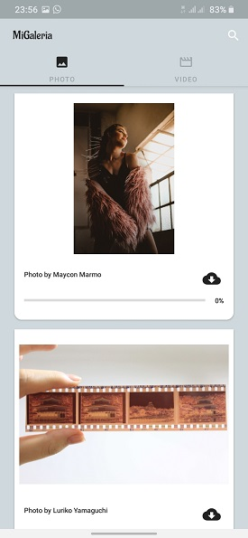

   

# MiGaleria
MiGaleria is a spanish word for My Gallery (according to Google of course). The application retrieves 
curated and popular photos and videos from [Pexels](https://www.pexels.com/) to be displayed to a user.
A user can also search for photos and videos using a keyword, e.g nature or programming. Please don't
search for Batman or The Avengers, you will be disappointed. The application is written with clean 
architecture in mind.

## ScreenShots

## Features
* Get curated and popular photos and videos
* User can play videos directly from the application all thanks to Exoplayer
* Supports dark mode
* Offline support - Using the room database, the application saves the contents from the server offline.
 But contents can't be downloaded or streamed.
* Download contents from the application to local storage

## Libraries
* MVVM with Android Architectural Components ([Room](https://developer.android.com/topic/libraries/architecture/room), [ViewModel](https://developer.android.com/topic/libraries/architecture/viewmodel), [LiveData](https://developer.android.com/topic/libraries/architecture/livedata))
* [Retrofit](https://github.com/square/retrofit)
* [Glide](https://github.com/bumptech/glide)
* [Moshi](https://github.com/square/moshi)
* [Ktor](https://ktor.io/)
* [Kotlin Coroutines](https://developer.android.com/kotlin/coroutines)
* [DataBinding](https://developer.android.com/topic/libraries/data-binding)
* [Navigation](https://developer.android.com/guide/navigation)
* [Exoplayer](https://github.com/google/ExoPlayer)
* [AdnetworkManager](https://github.com/wise4rmgod/AdnetwrokManager)

## License
[Apache License 2.0](http://www.apache.org/licenses/LICENSE-2.0.txt)
